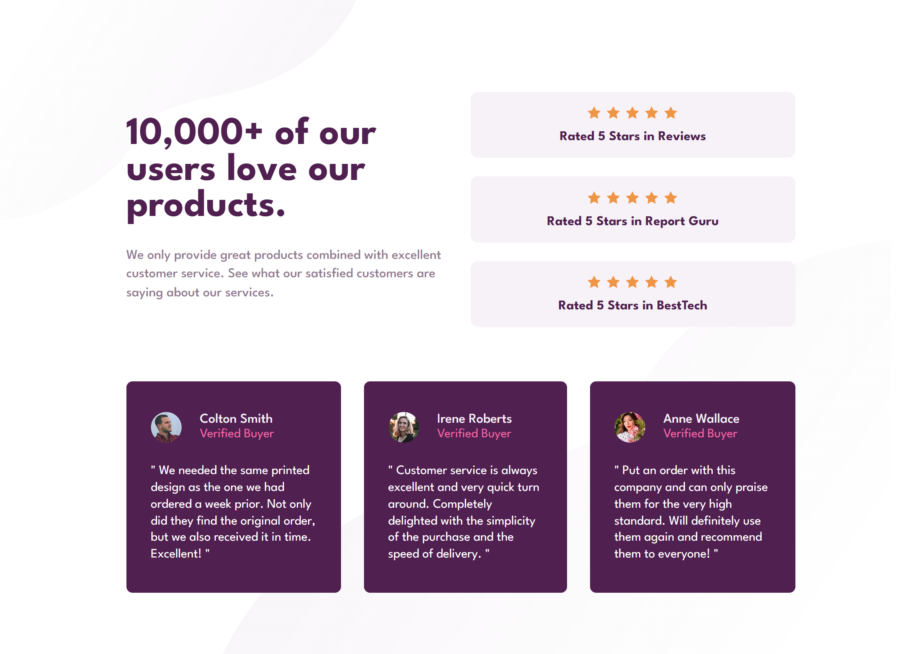

# Frontend Mentor - Social proof section solution

This is a solution to the [Social proof section challenge on Frontend Mentor](https://www.frontendmentor.io/challenges/social-proof-section-6e0qTv_bA). Frontend Mentor challenges help you improve your coding skills by building realistic projects.

## Table of contents

- [Overview](#overview)
  - [The challenge](#the-challenge)
  - [Screenshot](#screenshot)
  - [Links](#links)
- [My process](#my-process)
  - [Built with](#built-with)
- [Author](#author)

## Overview

### The challenge

Users should be able to:

- View the optimal layout for the section depending on their device's screen size

### Screenshot

### Links

- Solution URL: [https://www.frontendmentor.io/solutions/social-proof-section-rvqCZBtJep](https://www.frontendmentor.io/solutions/social-proof-section-rvqCZBtJep)
- Live Site URL: [https://rock-n-roll-crc.github.io/social-proof-section/](https://rock-n-roll-crc.github.io/social-proof-section/)

## My process

### Built with

- Semantic HTML5 markup
- Flexbox
- Media queries
- Mobile-first workflow

## Author

- Frontend Mentor - [@Rock_n_Roll_CRC](https://twitter.com/Rock_n_Roll_CRC)
- Twitter - [Danil_Dikhtyar 🔥](https://www.frontendmentor.io/profile/Rock-n-Roll-CRC)
- Discord - Rock_n_Roll_CRC#2944
